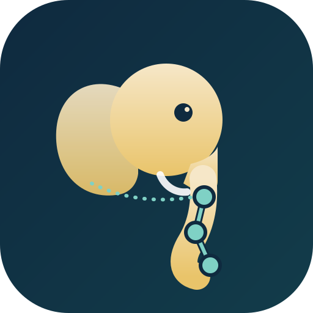
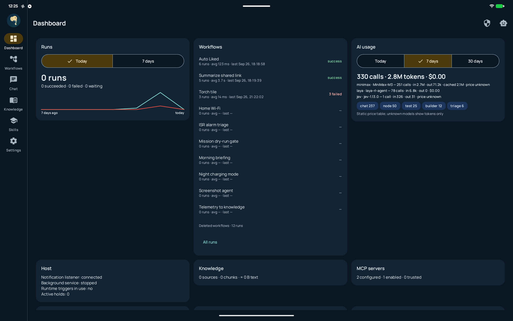
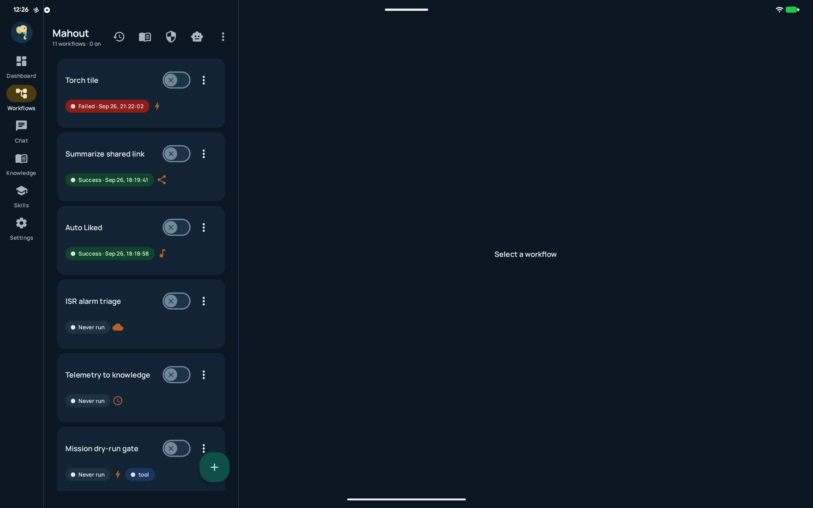
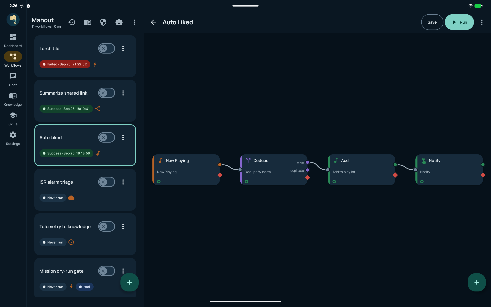
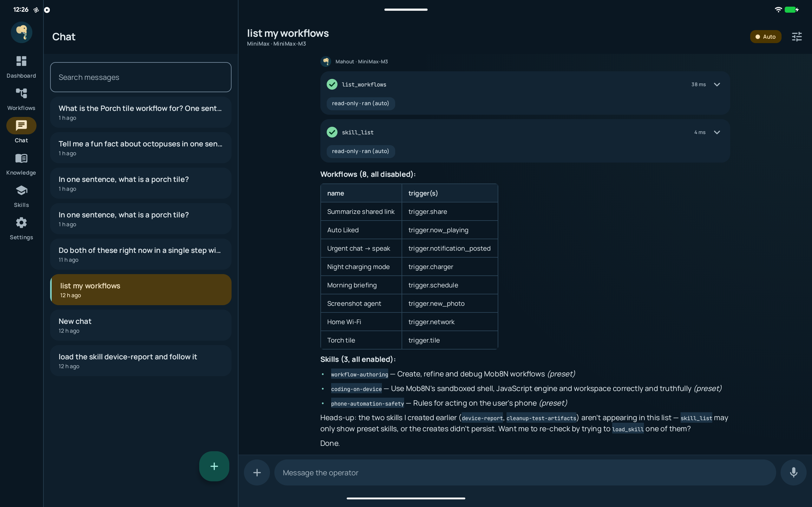
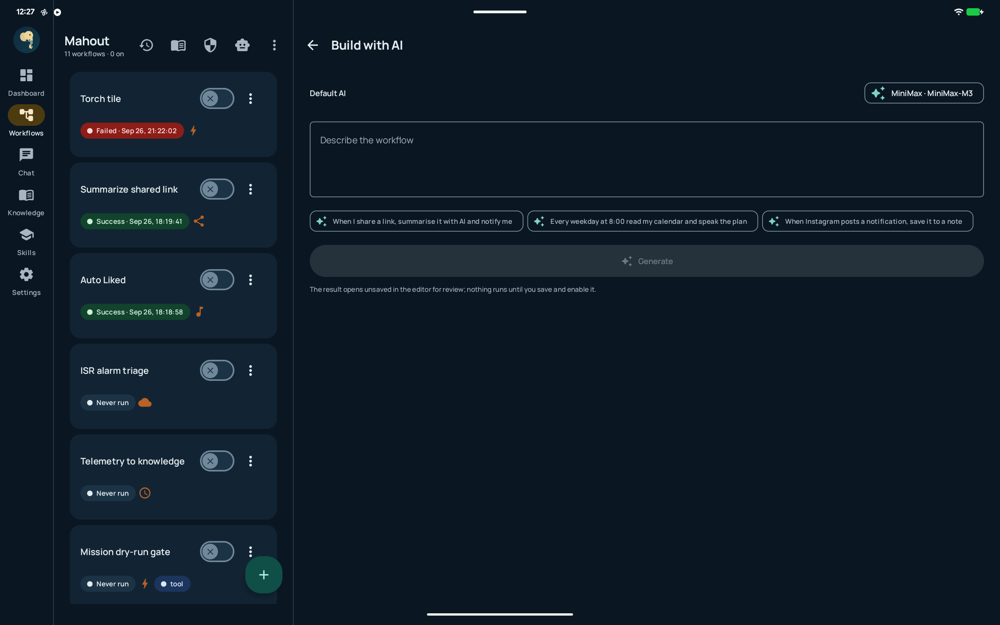
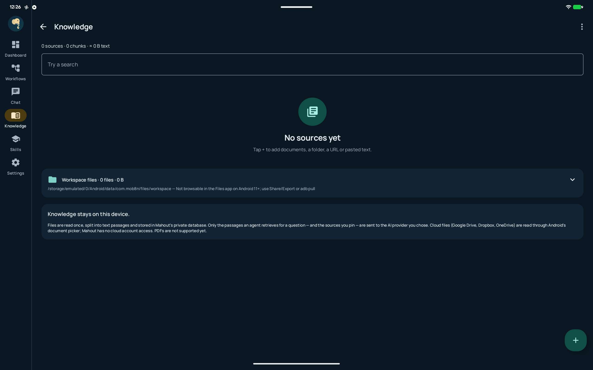
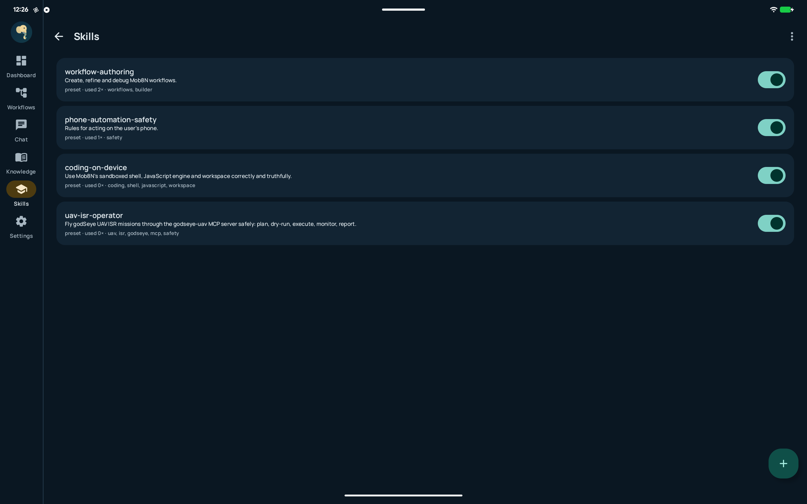
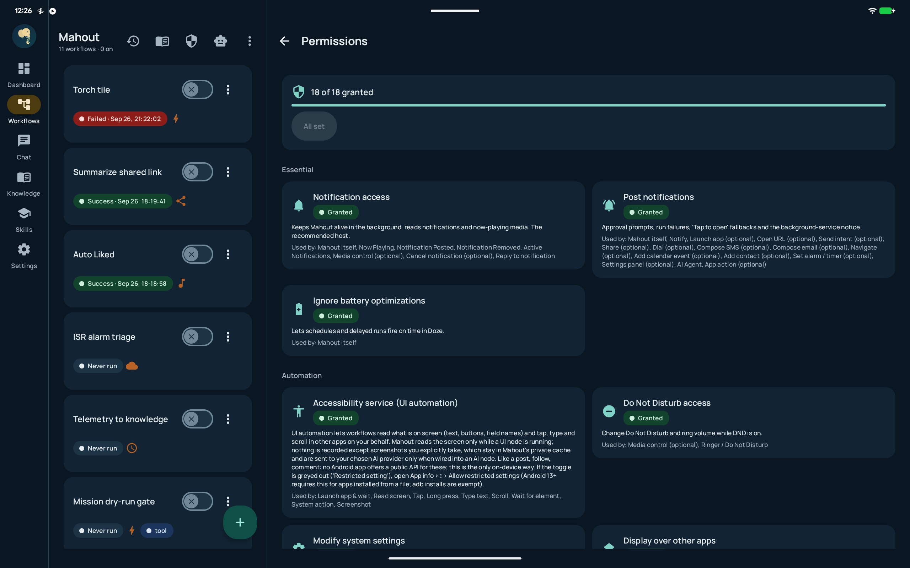

<p align="center">
  
</p>

<h1 align="center">Mahout</h1>

<p align="center"><strong>On-device workflow automation for Android — n8n meets Tasker.</strong></p>

<p align="center">
  
  
  
  
</p>

---

Every device capability is a **node**. Wire any node to any other node. Build automation workflows visually, or describe what you want and let **Build with AI** draft it. Run them manually, on schedules, or from real-world triggers — notifications, location, sensors, media, and more.

All AI runs on-device (Gemini Nano) or through your own API keys — **no cloud subscription, no account, your data stays on your phone.**

## Screenshots

<table>
  <tr>
    <td></td>
    <td></td>
  </tr>
  <tr>
    <td align="center"><strong>Dashboard</strong><br/>Run counts, AI spend, system health</td>
    <td align="center"><strong>Workflows</strong><br/>All your automations, one list</td>
  </tr>
  <tr>
    <td></td>
    <td></td>
  </tr>
  <tr>
    <td align="center"><strong>Editor</strong><br/>Drag-drop DAG canvas</td>
    <td align="center"><strong>Chat Operator</strong><br/>AI assistant, token-by-token streaming</td>
  </tr>
  <tr>
    <td></td>
    <td></td>
  </tr>
  <tr>
    <td align="center"><strong>Build with AI</strong><br/>Describe a workflow, AI drafts it</td>
    <td align="center"><strong>Knowledge</strong><br/>On-device RAG index</td>
  </tr>
  <tr>
    <td></td>
    <td></td>
  </tr>
  <tr>
    <td align="center"><strong>Skills</strong><br/>Agent skills + enable switches</td>
    <td align="center"><strong>Permissions</strong><br/>One-tap grant-all stepper</td>
  </tr>
</table>

---

## How It Works

### Nodes & Lanes

Every node is one self-contained Kotlin `object : Node` — a spec (params, inputs/outputs, gates, timeout) plus an `execute(ctx, input)` method. Nine lanes organise ~90+ nodes:

| Lane | What it contains |
|---|---|
| **Triggers** | Manual, schedule, notifications, sensors, location, calendar, webhooks, charging, proximity, system broadcasts |
| **Data** | HTTP requests, device info, media metadata, knowledge search, variable store |
| **Logic** | Conditions (if/else), loops, JS eval, text & math, merge, wait/delay |
| **AI** | Ask AI, Classify, Extract, Agent (tool-using loop), MCP tool/resource, Decision routing |
| **Actions** | Notifications, system settings (torch, DND, Wi-Fi, Bluetooth), send intents, file writes, playlist entries, knowledge ingest |
| **Apps** | Deep-link launches, shell commands, JS runtime, workspace file I/O, UI automation (Accessibility) |

### Visual Editor

A draggable, zoomable DAG canvas. Drop nodes from the palette, wire them together, configure params. The same params that drive the UI also drive Agent tool schemas, templating, validation, and log redaction.

### Template System

Fields are wired through a simple syntax that feels like a templating language:

```
{{title}}  {{meta.artist}}  {{items[0].name}}    &larr; current item fields
{{$node.HTTP.body.x}}                             &larr; upstream node's first output
{{$vars.counter}}                                  &larr; global variable
{{$now}} {{$date}} {{$time}}                      &larr; built-in values
{{field ?? "default"}}                            &larr; fallback when missing
```

### Chat Operator

An approval-gated AI assistant that manages your workflows, runs, knowledge, skills, and a coding sandbox — all from a natural-language interface. Four permission modes:

- **Plan** — no tools, read-only thinking
- **Ask** — per-call approval
- **Auto** — risk-based: safe actions (read/search) never ask, coding actions (shell/JS) ask, destructive actions (delete, UI automation) always require approval
- **Bypass** — time-limited full automatic, with a kill switch

The chat streams token-by-token and retains a turn history with tool-use results.

### AI Providers

11 OpenAI-compatible providers (OpenAI, OpenRouter, MiniMax, Gemini, Grok, DeepSeek, Mistral, Groq, Together, Ollama, Custom) + Claude SDK + Gemini Nano (on-device). All through **your own keys** — no Mahout cloud costs anything.

### Knowledge Base

On-device RAG: index documents, folders, URLs, pasted text, Notes, and Playlists. Room FTS4 storage with BM25 ranking. The Agent can search it with `knowledge_search`.

### MCP Support

Connect remote MCP servers (stdio or SSE) and expose their tools to the Agent or as plain workflow nodes.

### Panels

Running workflows control (suspend, cancel, resume), background host monitor, second-opinion, risk assessment, and System One decision engine — all from the Dashboard.

---

## Build

```bash
# Prerequisites: Android Studio Koala+, Java 17, Gradle 8.7+, NDK (for Room schema export)

git clone https://github.com/ankurCES/Mahout.git
cd Mahout

# Build & install
./build.sh profile   # or debug; or ./gradlew :app:installDebug
adb install -r app/build/outputs/apk/profile/app-profile.apk
```

See `docs/PLAN-v5.md` for the verification smoke-test plan.

---

## Architecture

```
Mob8NApp (manual DI)
  ├── Catalog (fused lane lists)
  ├── Engine (facade: start, save, run, chat, knowledge, skills)
  │   ├── TriggerHub (receiver/worker event dispatch)
  │   ├── Executor (pure Kotlin DAG runner, JVM-testable)
  │   ├── Knowledge (Room FTS4 RAG)
  │   ├── RoomPersistence (Room DAO seam)
  │   └── HostService / NotifListener (two live hosts)
  └── Lanes
      ├── core/      Nodes, Graph, Executor, Template, Params, Gates, Persistence
      ├── triggers/  Schedule, notifications, sensors, location, webhooks
      ├── data/      HTTP, device, media, knowledge, store
      ├── logic/     Conditions, loops, JS, text/math, wait
      ├── actions/   Notify, settings, intents, files, playlist
      ├── ai/        Ask, classify, extract, Agent, MCP Client, streaming
      ├── apps/      Shell, JS runtime, UI automation, workspace
      └── ui/        All Compose screens, theme, motion
```

Key design decisions:
- **One currency**: `kotlinx.serialization.json.JsonObject` for items, logs, templates, LLM I/O, Room blobs. No DTOs.
- **One node = one `object : Node`**: spec + execute in the same file, appended to its lane's `all` list.
- **Pure-Kotlin executor**: no Android types in core except a nullable `Context` handle. JVM-testable.
- **Two live hosts**: `NotifListenerService` (system-kept-alive) + `HostService` (specialUse FGS when needed).
- **Suspend/resume survives process death**: engine state persisted to Room before notifying or enqueuing a delay.
- **Manual DI, no Hilt, no ViewModels, no navigation-compose, no Retrofit/Moshi/Gson**.
- **Ponytail comments** mark deliberate shortcuts with a ceiling and an upgrade path.
- **Secrets**: plaintext app-private prefs, excluded from backup, masked in UI, redacted from logs.

---

## Testing

```bash
./gradlew test     # 674+ JVM unit tests (pure-Kotlin core, template, graph, permissions, motion)
```

The core executor, template engine, graph validation, param validation, gates, motion tokens, and dashboard math are all JVM-tested. Android instrumentation tests cover the rest.

---

## License

MIT — see the LICENSE file.

---

<p align="center"><em>Built with Kotlin, Compose, and an elephant's patience.</em></p>